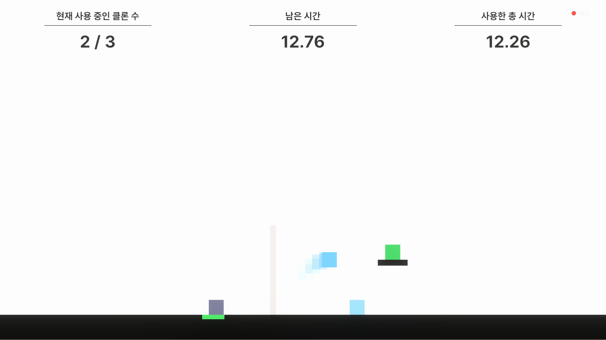

# After You

<p align="center">
  
</p>

> 캐릭터의 행동을 순차 녹화하면 **"과거의 나"가 클론으로 재생**됩니다.
> 무게·역할이 다른 정체성들을 순서를 고민해 배치하고, 과거의 나와 협력해 퍼즐을 푸는 2D 퍼즐 플랫포머입니다.

**▶ 게임플레이 영상: https://youtu.be/aam_NmDXf2g**

- **개발**: 1인 개발 (기획 · 프로그래밍 · 연출)
- **엔진**: Unity 6 (URP) / C#
- **상태**: 개발 중 — 코어 시스템 완성, 검증 레벨 8종 / **Steam 출시 목표**

---

## 게임 구조

핵심 루프: **캐릭터 선택 → 조작 + 녹화 → 확정 → 클론 재생 → 협력 클리어**

- **정체성 4종** — 무거운 / 가벼운 / 운반 / 벽타기. ScriptableObject 데이터로 정의되며 추가 정체성 확장을 전제로 설계
- **환경 기믹 9종** — 압력판·문, 토글 스위치, 시한 문, 이동 발판, 깨지는 발판, 킬존, 정체성 제한 포탈, 밀 수 있는 상자, 무게 차등 점프대. 전부 **설치형**(레벨 프리팹에 배치만으로 동작)
- **틱 기반 결정적 재생** — "같은 입력이면 항상 같은 결과"가 퍼즐 성립의 전제. 틱 구동 순서와 상태 전환 시점을 통제해 재생 재현성을 유지

## AI 주도 개발 파이프라인

이 프로젝트의 전 기능은 직접 설계한 **멀티에이전트 하네스**(Claude Code 기반)로 구현됩니다.

```
Planner ──→ Critic ──→ Generator ──→ Evaluator
 계획 수립    계획 검증     코드 생성      독립 채점
            (파괴 탐지)   (안전 규칙)    (스모크 실측)
                             ↑ 채점 미달 시 Refine (실패 원인 명시 재생성)
```

- **커밋 메시지의 `(하네스 N/100)`** 은 독립 에이전트 Evaluator의 채점 점수입니다 — `git log --oneline`으로 실제 운영 기록을 확인할 수 있습니다
- AI의 파괴적 변경을 구조적으로 차단 (100줄+ 파일 Edit 전용 강제, 호출부 사전 매핑, 줄 수 20% 감소 자동 경고)
- 실패는 로그로 누적해 다음 작업에서 같은 실수를 차단, Unity MCP로 에디터를 직접 조작·스크린샷 검증

**워크플로우 실물 문서**:

| 문서 | 내용 |
|---|---|
| [CLAUDE.md](CLAUDE.md) | 개발 규칙 체계 — 변경 안전 규칙, 하네스 전달 규칙 |
| [.claude/harness-eval.md](.claude/harness-eval.md) | Evaluator 채점 기준 |
| [.claude/harness-fail-log.md](.claude/harness-fail-log.md) | 실패 원인 분석 로그 (다음 회차 프롬프트에 반영) |
| [Docs/harness-logs/](Docs/harness-logs/) | 회차별 채점 기록 · 성공 패턴 |
| [Docs/Progress/HANDOFF.md](Docs/Progress/HANDOFF.md) | 세션 인수인계 스냅샷 — 현재 상태 · 유효 제약 · 폐기한 접근 |
| [Docs/Progress/](Docs/Progress/) | 일자별 작업 로그 |
